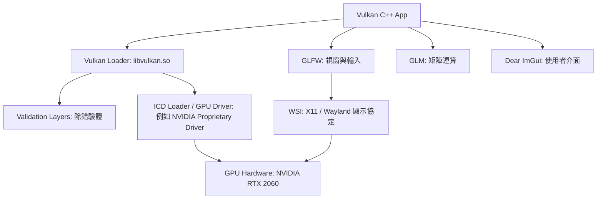
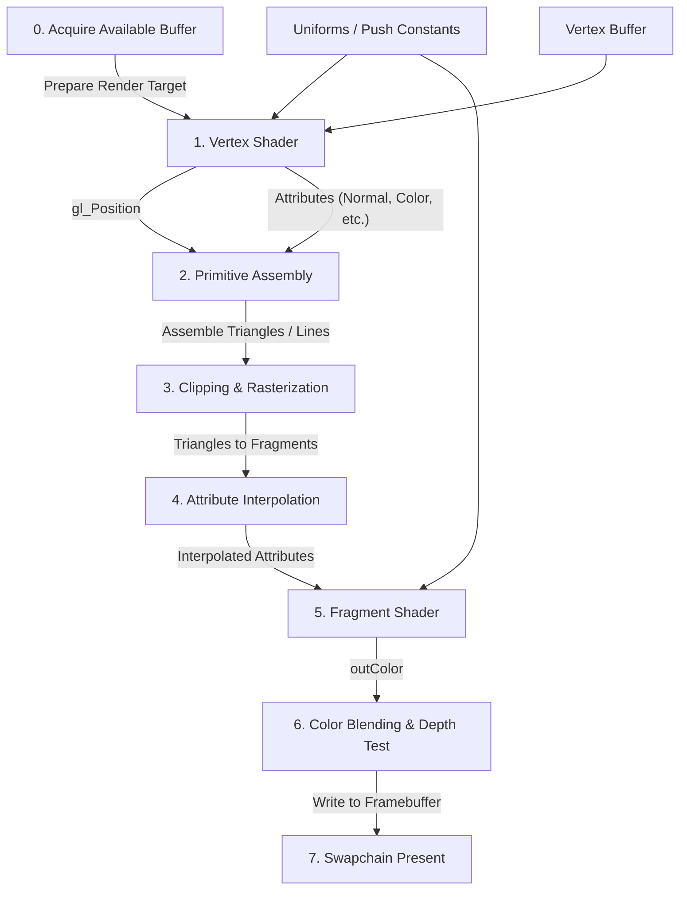
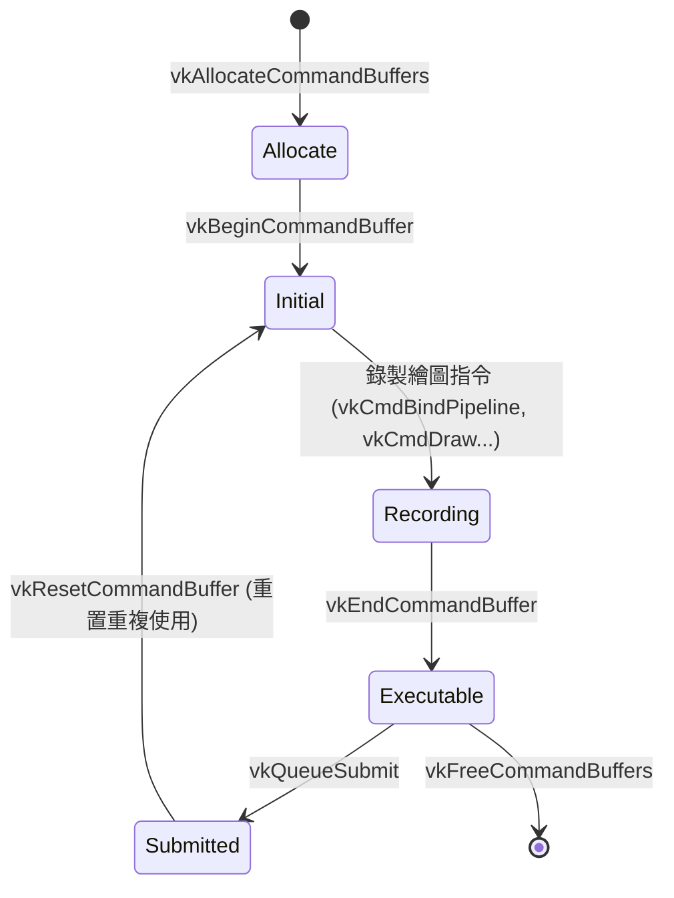
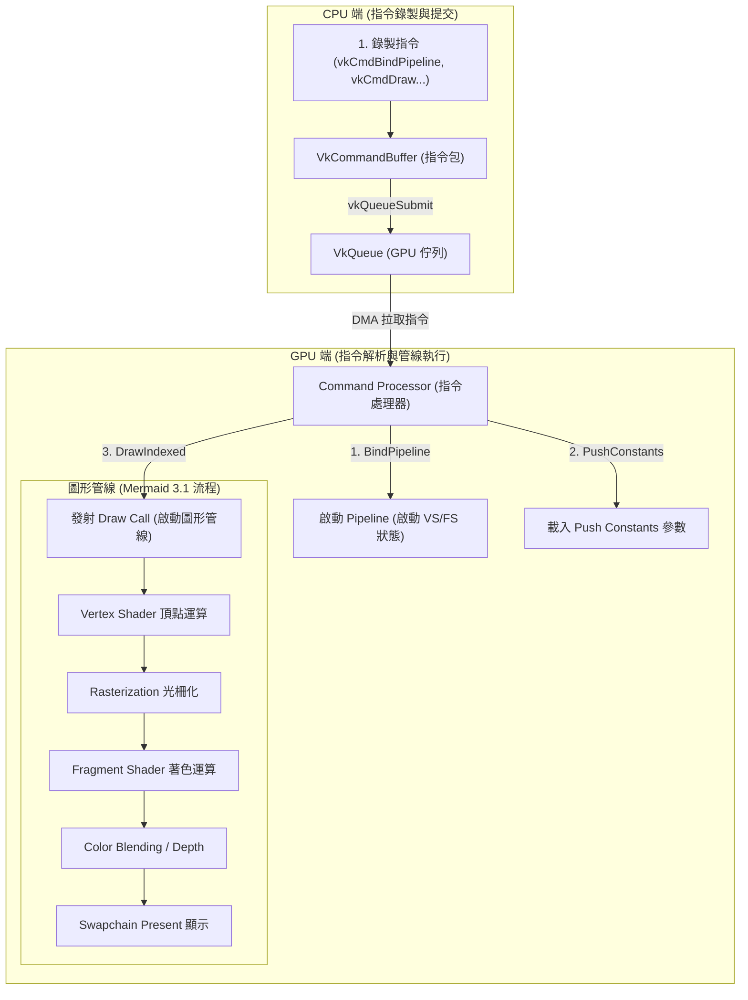
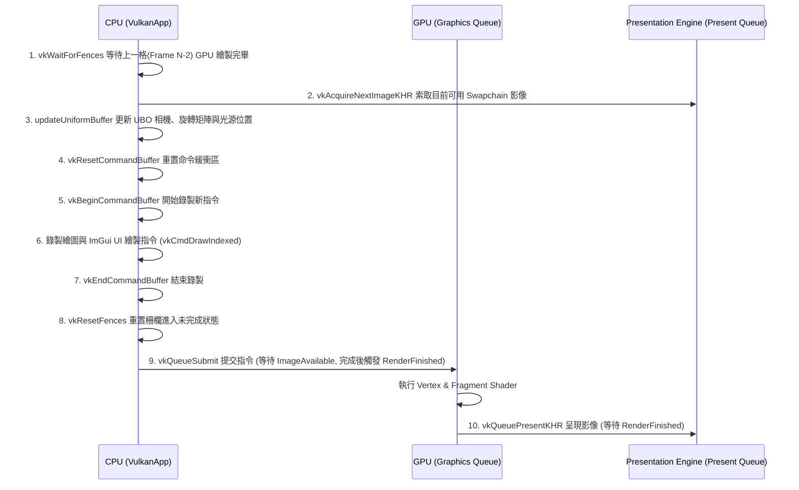
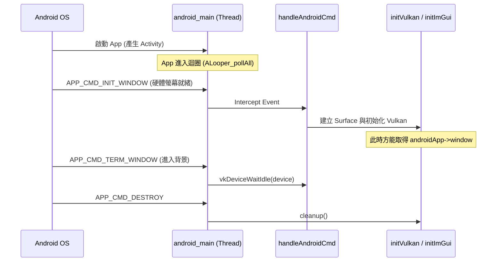

# Vulkan C++ 互動式 3D 專案：架構與效能分析指南

本指南將從零開始為您詳細解構此 Vulkan C++ 專案，深入探討 Vulkan API 的運作核心、專案的依賴關係、GPU 互動機制、Command Buffer 的生命週期，以及如何利用專業工具（如 NVIDIA Nsight Systems）來觀測與分析 GPU 效能指標。

---

## 1. 什麼是 Vulkan？

**Vulkan** 是由 Khronos Group 開發的現代、跨平台、低開銷（Low-overhead）的圖形與計算 API。它是為了解決舊世代 API（如 OpenGL）在現代硬體架構下的瓶頸而設計的。

與 OpenGL 相比，Vulkan 的核心哲學是 **「顯式控制」（Explicit Control）**：

*   **無隱藏狀態與驅動開銷**：OpenGL 驅動程式在背後做了大量繁重的狀態追蹤、記憶體管理和錯誤檢查，這導致了巨大的 CPU 開銷。Vulkan 將這些控制權完全移交給開發者。
*   **多執行緒友好（Multithreading-friendly）**：OpenGL 的 Context 是綁定在單一執行緒上的，難以進行並行錄製。Vulkan 的設計允許不同的 CPU 執行緒並行錄製繪圖指令（Command Buffer），最後再統一提交給 GPU。
*   **顯式同步與記憶體控制**：開發者必須自己管理 GPU 記憶體的分配、圖像佈局轉換（Image Layout Transitions）以及 CPU/GPU 之間的同步（Semaphore 和 Fence）。
*   **薄驅動（Thin Driver）**：Vulkan 驅動程式非常輕量，幾乎不做語法與運行時錯誤檢查。為了開發除錯，Vulkan 引入了可插拔的 **Validation Layers（驗證層）**，僅在開發時期開啟以確保正確性。

---

## 2. Vulkan 的依賴關係與 GPU 互動機制

要讓一個 Vulkan 應用程式在 Linux 系統上順利運行並渲染畫面，專案需要透過以下幾層依賴與 GPU 硬體進行溝通：



### 2.1 關鍵依賴庫說明
1.  **Vulkan SDK / Loader (`libvulkan.so`)**：
    *   應用程式不直接呼叫 GPU 驅動，而是呼叫 Vulkan Loader。
    *   Loader 負責在系統中尋找並加載 **ICD (Installable Client Driver)**，即顯示卡廠商提供的驅動程式，並動態分發 API 呼叫。
2.  **GPU 驅動 (ICD, 如 NVIDIA 驅動 `libGLX_nvidia.so` / `libvulkan_virtio.so`)**：
    *   直接與實體 GPU（NVIDIA GeForce RTX 2060）通訊，負責將 Vulkan 指令轉譯為硬體微代碼。
3.  **GLFW (Windowing & Input)**：
    *   Vulkan 本身是不具備視窗管理功能的。我們使用 [GLFW](https://github.com/glfw/glfw) 來建立作業系統視窗，並透過 WSI（Window System Integration）擴充元件，建立 Vulkan 的渲染表面（`VkSurfaceKHR`）。
4.  **GLM (OpenGL Mathematics)**：
    *   Header-only 的 C++ 數學庫，負責處理 3D 空間中的向量、矩陣運算（如投影矩陣、視圖矩陣、旋轉矩陣），以配合頂點著色器。
5.  **Dear ImGui**：
    *   輕量級的 UI 庫，本專案將其渲染指令併入 Vulkan 的主 Render Pass 中，實現實時參數調整面板。

### 2.2 邏輯設備（Logical Device）與硬體佇列（VkQueue）
GPU 與 CPU 是非同步運作的並行處理器。Vulkan 使用以下概念來管理它們之間的互動：

*   **實體設備（`VkPhysicalDevice`）**：代表系統中安裝的具體顯示卡，可用於查詢 GPU 名稱、極限參數及支援的佇列家族。
*   **邏輯設備（`VkDevice`）**：應用程式建立的軟體連接埠，代表對 GPU 的獨佔或共享連結。我們在此啟用所需的硬體功能（如 `fillModeNonSolid` 用於線框模式）。
*   **硬體佇列（`VkQueue`）**：GPU 的指令入口。硬體通常提供幾種不同用途的佇列：
    *   *Graphics Queue*：處理繪圖指令、著色器執行。
    *   *Compute Queue*：處理通用計算（Compute Shader）。
    *   *Transfer Queue*：處理記憶體複製（例如從 CPU 記憶體上傳頂點資料到 GPU 專用顯存）。
    *   *Present Queue*：將渲染好的影像遞交給螢幕顯示系統。
    *   *本專案中*：我們獲取了 Graphics Queue 與 Present Queue，將錄製好的 Command Buffer 提交給它們執行。

---

## 3. Vertex Shader 與 Fragment Shader 在 GPU 中的執行流程

在 GPU 內部，渲染 3D 幾何圖形並顯示在螢幕上的過程，是由一連串高度並行的硬體運作階段所組成，這被稱為 **圖形管線（Graphics Pipeline）**。本專案所使用的 **Vertex Shader（頂點著色器）** 與 **Fragment Shader（片段著色器）** 是其中唯二可以由我們撰寫程式碼控制的可程式化階段（Programmable Stages）。

### 3.1 GPU 執行與渲染管線流程圖

下面是 GPU 執行這兩個著色器並繪製出本專案 3D 幾何體（如 Torus）的完整流程：



### 3.2 頂點著色器 (Vertex Shader) 的職責與 GPU 執行方式
* **主要程式檔案**：[shader.vert](file:///home/lance.bai/local/vulkan/shaders/shader.vert)
* **執行次數**：**每個「頂點」執行一次**。例如，如果 Torus 細分程度為 80x40，共有約 3,200 個頂點，Vertex Shader 就會並行地被 GPU 執行 3,200 次。
* **主要任務**：
  1. **座標轉換**：接收 CPU 傳來的頂點 3D 座標，並乘以 `Model`、`View`、`Projection` 矩陣，轉換成裁剪空間座標（Clip Space），並輸出給內建變數 `gl_Position`。
  2. **資料傳遞**：將頂點法線（Normal）、光源方向（Light Direction）、觀察方向（View Direction）等資訊，透過 `out` 變數傳遞給下一個階段。
* **GPU 執行特性**：
  GPU 內部有數千個小型的著色器核心（Shader Cores）。這些核心會**高度並行地**同時計算多個頂點，彼此互不干擾。

### 3.3 片段著色器 (Fragment Shader) 的職責與 GPU 執行方式
* **主要程式檔案**：[shader.frag](file:///home/lance.bai/local/vulkan/shaders/shader.frag)
* **執行次數**：**每個被光柵化覆蓋的「畫素（片段）」執行一次**。例如，在 1080p 螢幕上，若 Torus 覆蓋了 500,000 個畫素，Fragment Shader 就會被並行執行 500,000 次。
* **主要任務**：
  1. **光影與材質計算**：接收經由光柵化自動「插值（Interpolated）」過後的法線、頂點位置與光照方向，並計算 Phong 光照模型（Ambient, Diffuse, Specular 混合）。
  2. **顏色輸出**：決定該畫素最終要在螢幕上顯示的 RGBA 顏色值（輸出到 `outColor`）。
* **GPU 執行特性**：
  * **畫素級並行**：GPU 會將螢幕劃分成多個 2x2 的畫素塊（Quad），由不同的運算單元同步且並行地計算每個畫素的顏色。
  * **效能瓶頸點**：這也是為什麼當我們在 `shader.frag` 中加入 `gpuLoadIterations` 的龐大迴圈時，GPU 效能會瞬間崩潰（Drop 到 1 FPS）。因為該迴圈會在數百萬個畫素上**同時且重複執行數十萬次**，這對 GPU 的算術邏輯單元（ALU）是極大的考費與考驗。

---

## 4. Command Buffer 在 Vulkan 中的生命週期與使用

Vulkan 將指令的「錄製」與「執行」完全解耦。CPU 負責把指令錄製到 **Command Buffer（指令緩衝區）** 中，隨後將其一次性提交給 **`VkQueue`** 由 GPU 非同步執行。

### 4.1 核心機制與生命週期



1.  **Command Pool (`VkCommandPool`；指令池)**：
    *   分配 Command Buffer 的記憶體池。由於記憶體分配開銷極大，Command Pool 綁定在特定的佇列家族上，用於減少記憶體碎片。
2.  **錄製流程（Recording）**：
    *   呼叫 `vkBeginCommandBuffer()` 將緩衝區置於 *Recording* 狀態。
    *   使用 `vkCmd...` 系列 API 開始錄製指令。例如：
        *   `vkCmdBeginRenderPass`：開始一個渲染流程，設定背景清除顏色（Clear Color）。
        *   `vkCmdBindPipeline`：繫結圖形管線（決定頂點格式、線框/填滿模式、著色器）。
        *   `vkCmdBindVertexBuffers` & `vkCmdBindIndexBuffer`：設定幾何體頂點資料。
        *   `vkCmdPushConstants`：以極快速度將微小資料（如當前時間、渲染模式）傳遞給著色器。
        *   `vkCmdDrawIndexed`：發射繪圖調用。
        *   `vkCmdEndRenderPass` & `vkEndCommandBuffer`：結束錄製，此時緩衝區進入 *Executable* 狀態。
3.  **提交執行（Submission）**：
    *   呼叫 `vkQueueSubmit()` 將錄製好的 Command Buffer 送入 GPU 的 Graphics Queue，GPU 便開始非同步繪圖。

### 4.2 Command Buffer 與 GPU 渲染管線的關係

如果您覺得「圖形管線的執行流程（3.1）」與「Command Buffer（4.1）」這兩個概念有些重疊，這很正常。以下是它們的關係解讀：

* **渲染管線（Graphics Pipeline）是「工廠與機器」**：它是一個靜態的配置（如 Vertex Shader、Fragment Shader、深度測試等設定），靜靜地待在 GPU 顯存中，告訴 GPU「該如何組裝與渲染資料」。
* **Command Buffer 是「自動化生產的指令清單」**：它由 CPU 錄製，裡面記錄著一連串具體的控制指令（如綁定哪台機器、餵入哪包頂點原料、何時啟動開關）。

以下流程圖展示了 CPU 錄製的 Command Buffer 是如何作為「指令媒介」來遙控和觸發 GPU 渲染管線的：



這說明了，**GPU 渲染管線本身是靜態的，只有當 Command Buffer 內錄製的繪圖指令（如 `vkCmdDrawIndexed`）被提交給 GPU 執行時，整個渲染管線（Vertex Shader -> Rasterization -> Fragment Shader）才會被真正啟動運轉。**

---

### 4.3 CPU-GPU 同步機制（如何安全地重置與重複使用）
因為 GPU 與 CPU 是並行且非同步的，CPU 在提交指令後不能馬上重置 Command Buffer 或修改 Uniform 記憶體，否則會造成 GPU 讀取到髒資料甚至當機。本專案使用了以下同步機制：

*   **`VkFence`（柵欄 - CPU與GPU同步）**：
    *   用於讓 CPU 等待 GPU 完成工作。我們在 `drawFrame()` 開頭呼叫 `vkWaitForFences()`，確保上一幀（`MAX_FRAMES_IN_FLIGHT` 之前）的 GPU 渲染已經完全結束，才開始寫入新的 Uniform Buffer 與重置該幀的 Command Buffer。
*   **`VkSemaphore`（信號標 - GPU內部的非同步同步）**：
    *   用於同步 GPU 內部不同的 Queue 操作，不需要 CPU 介入等待。
    *   *Image Available Semaphore*：當 `vkAcquireNextImageKHR` 成功把 swapchain 影像準備好時，GPU 會自動信號通知此 Semaphore；繪圖提交（`vkQueueSubmit`）將此 Semaphore 設為等待條件，確保影像就緒才開始著色。
    *   *Render Finished Semaphore*：GPU 完成 Command Buffer 的渲染後會信號此 Semaphore；呈現操作（`vkQueuePresentKHR`）等待此 Semaphore，確保繪圖完成後才把影像打到螢幕上。

---

### 4.4 recordCommandBuffer 的具體步驟與實作

在 [vulkan_app.cpp](file:///home/lance.bai/local/vulkan/src/vulkan_app.cpp) 的 [recordCommandBuffer](file:///home/lance.bai/local/vulkan/src/vulkan_app.cpp#L1213) 函式中，我們將 CPU 的渲染指令逐步錄製進 `VkCommandBuffer`。以下是核心 API 呼叫順序與邏輯：

1. **啟動命令錄製 (`vkBeginCommandBuffer`)**：
   * 呼叫 `vkBeginCommandBuffer(commandBuffer, &beginInfo)` 將 Command Buffer 轉換為錄製狀態（Recording State）。
2. **配置並開始渲染通道 (`vkCmdBeginRenderPass`)**：
   * 配置 `VkRenderPassBeginInfo`：設定目標 Framebuffer（對應當前的 Swapchain Image 與 Depth Image），並設定色彩清除值（背景顏色，如深藍色）與深度清除值（1.0f）。
   * 呼叫 `vkCmdBeginRenderPass(commandBuffer, &renderPassInfo, VK_SUBPASS_CONTENTS_INLINE)`。
3. **設定動態 Viewport 與 Scissor (`vkCmdSetViewport` / `vkCmdSetScissor`)**：
   * `vkCmdSetViewport`：指定 3D 空間投影渲染到螢幕的哪一個區域（X, Y, 寬, 高）。
   * `vkCmdSetScissor`：定義像素剪裁矩陣，防止不必要的像素繪製。
4. **綁定圖形管線 (`vkCmdBindPipeline`)**：
   * 呼叫 `vkCmdBindPipeline(commandBuffer, VK_PIPELINE_BIND_POINT_GRAPHICS, graphicsPipeline)`，啟用我們在初始化時建立的 3D 著色器渲染管線。
5. **綁定頂點與索引緩衝區 (`vkCmdBindVertexBuffers` / `vkCmdBindIndexBuffer`)**：
   * `vkCmdBindVertexBuffers`：將 Torus/Sphere 的 Vertex Buffer 綁定到 Input Assembly。
   * `vkCmdBindIndexBuffer`：將 Index Buffer 綁定，以確定頂點連接成三角形的順序。
6. **綁定描述符集 (`vkCmdBindDescriptorSets`)**：
   * 呼叫 `vkCmdBindDescriptorSets`，將對應當前 Frame 的 Uniform Buffer（儲存相機 View 矩陣、Projection 矩陣與光源位置）傳遞給 Vertex Shader。
7. **推送動態常數 (`vkCmdPushConstants`)**：
   * 呼叫 `vkCmdPushConstants` 將輕量級控制常數（例如當前時間 `time`、著色模式 `colorMode`、GPU 壓力測試迭代次數 `gpuLoadIterations`）直接嵌入指令流傳給 Fragment Shader。
8. **發射繪圖指令 (`vkCmdDrawIndexed`)**：
   * 呼叫 `vkCmdDrawIndexed(commandBuffer, indicesSize, 1, 0, 0, 0)` 正式通知 GPU 執行幾何繪製。
9. **整合 ImGui UI 繪圖數據**：
   * 呼叫 `renderImGui()`，隨後調用 `ImGui_ImplVulkan_RenderDrawData(ImGui::GetDrawData(), commandBuffer)` 將側邊欄控制 UI 的頂點與紋理資料疊加渲染到同一個 Render Pass。
10. **結束渲染通道與命令錄製 (`vkCmdEndRenderPass` / `vkEndCommandBuffer`)**：
    * 呼叫 `vkCmdEndRenderPass(commandBuffer)` 結束渲染，Vulkan 會將影像自動轉換為適合 Present（顯示）的 Layout。
    * 呼叫 `vkEndCommandBuffer(commandBuffer)` 結束錄製，命令緩衝區隨後即可被 `vkQueueSubmit` 提交。

---

## 5. 如何查看 GPU 的 Benchmarks？

在 Linux 下分析 Vulkan 專案，最推薦且專業的工具是 **NVIDIA Nsight Systems (`nsys`)**。它可以捕獲系統級的 CPU 與 GPU 活動，顯示完整的時間線（Timeline Trace），並定位效能瓶頸。

### 5.1 使用 Nsight Systems 進行 CLI 性能分析

> [!NOTE]
> **Debug 模式特別說明**：
> 如果您是在 **Debug 模式**下執行或分析本專案，請務必先設定環境變數 `VK_LAYER_PATH`，以確保 Vulkan 的驗證層（Validation Layers）能夠被正確載入。您可以在終端機中執行：
> ```bash
> export VK_LAYER_PATH=/home/lance.bai/local/vulkan/vulkansdk/x86_64/share/vulkan/explicit_layer.d
> ```
> 或是直接在啟動指令前置該變數。

您可以使用終端機直接啟動 `nsys` 來對本專案進行效能取樣。在 `/home/lance.bai/local/vulkan` 底下執行以下指令：

```bash
# 啟動 Nsys 進行 Vulkan 及 OS 運行時追蹤
nsys profile \
  -w true \
  -t vulkan,osrt,opengl \
  --sample=none \
  -o vulkan_perf_report \
  ./build/vulkan_app
```

**參數解析：**
*   `-w true`：在控制台實時輸出 profiler 的警告和運行狀態。
*   `-t vulkan,osrt,opengl`：指定追蹤的 API。這裡重點追蹤 **Vulkan** API 的呼叫和驅動活動，以及 OS 系統調用（`osrt`）。
*   `--sample=none`：停用 CPU 呼叫棧的定時取樣。這能顯著加快報告檔案的生成速度，避免載入龐大除錯符號的耗時。
*   `-o vulkan_perf_report`：輸出報告的檔名，會在目錄下產生 `vulkan_perf_report.nsys-rep`。

### 5.2 終端機統計摘要數據（CLI Summary）
當您運行幾秒鐘並關閉視窗後，`nsys` 會寫出報告檔案。您可以在終端機中直接提取 GPU 核心（Kernels）與 Vulkan API 的調用摘要：

```bash
# 查看 Vulkan 驅動 API 的 CPU 調用時長與頻率統計
nsys stats --report vulkan_api_sum vulkan_perf_report.nsys-rep
```

這會輸出一個清晰的表格，顯示哪些 Vulkan API 佔用了最多 CPU 時間。例如，頻繁的 `vkQueueSubmit` 或 `vkWaitForFences` 可能代表 CPU 在等待 GPU，或是提交次數過於頻繁。

### 5.3 實例剖析：本專案 Vulkan API 效能數據分析

以下為本專案在一個測試週期中（約 2,270 幀）產生的真實效能統計報告及解讀：

| Time (%) | Total Time (ns) | Num Calls | Avg (ns) | Med (ns) | Min (ns) | Max (ns) | Name |
| :--- | :--- | :--- | :--- | :--- | :--- | :--- | :--- |
| **90.6** | 32,142,342,265 | 2,270 | 14,159,622.1 | 14,177,551.0 | 8,424 | 39,730,536 | `vkAcquireNextImageKHR` |
| **6.5** | 2,308,237,755 | 2,270 | 1,016,844.8 | 744,263.0 | 71,287 | 27,581,991 | `vkQueuePresentKHR` |
| **0.8** | 287,670,403 | 2,274 | 126,504.1 | 119,787.0 | 14,779 | 2,870,358 | `vkQueueSubmit` |
| **0.8** | 287,494,193 | 2,271 | 126,593.7 | 114,908.0 | 5,214 | 4,168,379 | `vkWaitForFences` |
| **0.3** | 98,132,460 | 4,540 | 21,615.1 | 21,970.0 | 5,580 | 62,931 | `vkCmdBindPipeline` |
| **0.1** | 33,735,020 | 4,543 | 7,425.7 | 6,205.0 | 794 | 48,213 | `vkMapMemory` |
| **0.0** | 12,471,660 | 4,541 | 2,746.5 | 2,076.0 | 654 | 29,046 | `vkUnmapMemory` |

#### 關鍵診斷與分析：

1. **垂直同步瓶頸（VSync-Bound）：**
   * **現象**：`vkAcquireNextImageKHR` 佔據了高達 **90.6%** 的 Vulkan API 總執行時間，且每次平均等待時間為 **14.16 ms**。
   * **分析**：這表示 CPU 的速度遠高於 60FPS 的渲染限制（16.67 ms 一影格）。在一幀中，CPU 僅花費約 **2.5 ms** 完成運算並向 GPU 提交後，便在 `vkAcquireNextImageKHR` 中掛起，等待 Presentation Engine 空出下一個 Swapchain 緩衝區。這說明程式在目前的幾何與渲染複雜度下具有極大的 CPU 與 GPU 效能餘裕。

2. **超輕量的驅動與繪圖提交開銷：**
   * **現象**：`vkQueueSubmit` 與 `vkWaitForFences` 兩者加總僅佔 API 時間的 **1.6%**，每次提交的平均時間僅約 **126 微秒**。
   * **分析**：這證實了本專案的設計沒有無效的同步等待，Vulkan 的「顯式控制」與「薄驅動」讓 CPU 幾乎沒有驅動層瓶頸（Driver Overhead），且 GPU 能及時在 Fence 設定的上限內完成工作。

3. **Dear ImGui 動態頂點上傳：**
   * **現象**：`vkMapMemory` 呼叫次數為 4,543 次，`vkUnmapMemory` 為 4,541 次，約為每影格各被呼叫 2 次。
   * **分析**：在專案的主程式 [vulkan_app.cpp](file:///home/lance.bai/local/vulkan/src/vulkan_app.cpp) 中，我們在 [createUniformBuffers](file:///home/lance.bai/local/vulkan/src/vulkan_app.cpp#L813-L824) 對 Uniform Buffer 採用了永久映射（Persistent Mapping）優化（僅映射一次，終生不解除）。而這裡每幀頻繁的 Map/Unmap，實際上是源自於 Dear ImGui 的渲染器。為了繪製與上傳每幀隨動態 UI（如選單、滑桿）變更的 UI 頂點與索引緩衝，ImGui 的 Vulkan 後端會頻繁地映射與解除映射記憶體。這對於輕量 UI 來說完全合理，但在極限渲染場合下，也是一處可供優化的監測點。

### 5.4 實例剖析：模擬極端 GPU-Bound（約 1 FPS）效能數據分析

以下為拉高 GPU 模擬負載（約 200,000+ 次片段著色器迴圈）後，本專案在一個測試週期中（約 196 幀）產生的真實效能統計報告及解讀：

| Time (%) | Total Time (ns) | Num Calls | Avg (ns) | Med (ns) | Min (ns) | Max (ns) | Name |
| :--- | :--- | :--- | :--- | :--- | :--- | :--- | :--- |
| **88.1** | 18,888,729,687 | 196 | 96,371,069.8 | 247,453.5 | 70,392 | 859,600,412 | `vkQueuePresentKHR` |
| **10.7** | 2,303,271,607 | 196 | 11,751,385.8 | 14,582,184.5 | 8,079 | 32,429,782 | `vkAcquireNextImageKHR` |
| **0.1** | 30,647,753 | 200 | 153,238.8 | 122,168.5 | 14,621 | 3,765,135 | `vkQueueSubmit` |
| **0.1** | 21,443,255 | 196 | 109,404.4 | 108,184.0 | 4,126 | 437,836 | `vkWaitForFences` |

#### 關鍵診斷與分析：

1. **達到約 1 FPS 的極端 GPU 瓶頸：**
   * **現象**：`vkQueuePresentKHR` 的最大耗時（Max）達到了驚人的 **859.6 毫秒（0.86 秒）**，這代表有些影格單次畫面呈現就卡頓了近一秒。
   * **分析**：這與我們手動調整 GPU 負載的行為相符。極為繁重的片段著色器運算讓 GPU 的 ALU 核心滿載，導致渲染時間陡增。最慢的一影格達到了約 `1.16 FPS`。

2. **「中位數」與「平均值」的巨大落差：**
   * **現象**：`vkQueuePresentKHR` 的中位數（Med）僅為 **0.24 ms**，但平均耗時（Avg）卻被大幅拉高至 **96.37 ms**，且標準差高達 227.1 ms。
   * **分析**：這記錄了在運行過程中動態拖動滑桿的過程。在滑桿為 0（正常）時，影格極其流暢，因此大於 50% 的呼叫時間都在 0.24 ms 上下一閃而過；而在後半段拉高負載後，影格時間暴增數百毫秒，拉高了整體平均值。這在效能分析中能反映出「效能陡升陡降」的過程。

3. **驅動程式限流（Driver Throttling）阻斷位置：**
   * **現象**：我們常預期 GPU 瓶頸時 CPU 會卡在 `vkWaitForFences`，但在數據中 `vkWaitForFences` 平均耗時僅有 **109 微秒**，主要耗時都在 `vkQueuePresentKHR`（88.1%）。
   * **分析**：這是 NVIDIA 驅動程式與作業系統視窗合成器的限流保護機制。當 GPU 已經被超載的著色運算塞滿時，驅動程式在執行 `vkQueuePresentKHR` 時會直接將 CPU 執行緒阻斷（Block）以防止 CPU 遞交過多無效的畫格，形成了 Present 呼叫耗時暴增的特殊現象。這正是偵測 GPU-Bound 狀態最典型的「指紋特徵」之一。

> [!NOTE]
> **跨平台 Profiling 的 GPU-Bound 特徵差異 (Desktop vs ARM)**
> 
> 雖然「驅動程式限流（Back-pressure）」是所有平台共通的防護機制，但在不同平台上，發生阻塞（Block）的具體 API 呼叫點會有些微差異：
> * **Desktop (Windows/Linux + NVIDIA/AMD)**：通常如上列數據，阻塞點會發生在 `vkQueuePresentKHR`，驅動程式在呈現畫面時會要求 CPU 暫停，等待前面的畫面繪製完畢。
> * **Mobile/ARM (Android + Mali/Adreno)**：在 Android 平台上（因為採用 SurfaceFlinger 與 BufferQueue 機制），阻塞點通常會提早發生在 **`vkAcquireNextImageKHR`**。當 GPU 處理過慢時，BufferQueue 中的所有交換鏈緩衝區可能都正在被佔用，導致下一次呼叫 `vkAcquireNextImageKHR` 想拿新畫布時被迫卡住等待空閒的 Buffer。
> 
> **結論**：不管在哪個平台，只要在 Profiler 中看到與 Swapchain 互動的 API（`Acquire` 或 `Present`）耗時發生數十甚至數百毫秒的極端異常峰值，這通常就是確診 **GPU-Bound** 的關鍵指標。

---

## 6. 如何去 Profile Vulkan 專案並尋找瓶頸？

Profile 的核心目的是尋找 **CPU 瓶頸** 或 **GPU 瓶頸**。以下是常見的診斷與最佳化步驟：

### 6.1 步驟一：判斷 CPU-Bound 還是 GPU-Bound
打開 Nsight Systems GUI 載入 `.nsys-rep` 檔案，觀察時間線：
*   **CPU-Bound（CPU 瓶頸）**：
    *   *特徵*：CPU 執行緒滿載（例如一直在執行事件循環或錄製 Command Buffer），而 GPU 的 Queue 區段斷斷續續，GPU 利用率（GPU Utilization）低下。
    *   *Vulkan 常見原因*：每幀錄製太多 Command Buffer、過多碎小的 `vkQueueSubmit`、或者频繁使用 `vkMapMemory` 造成記憶體地帶衝突。
*   **GPU-Bound（GPU 瓶頸）**：
    *   *特徵*：GPU 佇列（Graphics Pipeline）呈現密集的單一長條區段，GPU 核心利用率接近 100%，而 CPU 執行緒大部分時間都在 `vkWaitForFences` 處於 Sleep 狀態。
    *   *本專案常見原因*：渲染的幾何體細緻度過高（例如球體 segment 設過大）、著色器運算複雜（如 `shader.frag` 中的 specular 運算與 rainbow wave 動態計算過重）。

### 6.2 本專案的最佳化實踐與 Profiling 設計

在我們實作的 [vulkan_app.cpp](file:///home/lance.bai/local/vulkan/src/vulkan_app.cpp) 中，我們已經考慮了許多 Profiling 與性能防禦設計：

1.  **永久映射 Uniform Buffer（Persistent Mapping）**：
    *   我們在 `createUniformBuffers()` 中使用 `vkMapMemory` 將內存映射到 CPU 位址空間後，**終生不進行 `vkUnmapMemory`**。
    *   在每一幀更新矩陣時（`updateUniformBuffer`），我們直接進行 `memcpy`。這消除了每幀動態映射與取消映射的巨大 OS 開銷，是極佳的 CPU 減負設計。
2.  **避免每幀重建 Pipeline**：
    *   在 GUI 面板中，使用者開啟「線框模式（Wireframe）」時，如果我們動態去銷毀並重新編譯 Shader 與 Pipeline，會造成畫面嚴重的卡頓（Frame Drop）。
    *   *解決方案*：我們在初始化時同時創建了 Fill 模式的 `graphicsPipeline` 與 Line 模式的 `wireframePipeline`。在 `recordCommandBuffer` 時，我們僅需根據 `drawWireframe` 變數來 Bind 不同的 Pipeline，切換開銷幾近於零。
3.  **Validation Layers 的開關**：
    *   Validation Layers 內部有大量的狀態追蹤與邊界檢查，這會使 CPU 開銷增加 5 到 10 倍。
    *   在進行真正的效能測試與 Benchmarking 時，必須確保編譯為 **`Release`** 模式（定義 `NDEBUG` 巨集），使 `enableValidationLayers` 為 `false`，否則量測到的 FPS 與 CPU Latency 將失去參考價值。
4.  **幾何體重建優化**：
    *   當在 ImGui 選單中切換幾何形狀（Torus, Trefoil Knot, Sphere）時，程式會呼叫 `generateGeometry()` 重新計算 CPU 頂點，並呼叫 `vkDeviceWaitIdle` 來清空 GPU 隊列，然後重建 Vertex / Index Buffer。
    *   這種 CPU 重新計算並重新上傳 GPU 的操作開銷很大，這在切換形狀時會引發一次暫時的 CPU 尖峰（Frame Spike），但在主循環中，頂點資料是常駐 GPU 的，因此不影響正常的渲染流暢度。
5.  **可調整的 GPU 瓶頸模擬（Simulated GPU Bottleneck）**：
    *   我們在 GUI 的 `Performance & Benchmark` 面板中，實作了 `GPU Load Iterations` 控制滑桿，其數值會透過 **Push Constants** 動態傳入 Fragment Shader [shader.frag](file:///home/lance.bai/local/vulkan/shaders/shader.frag)。
    *   當該滑桿被拉高時，Shader 內會對每一個畫素的著色過程執行對應次數的複雜三角函數與數學運算，強制製造 GPU 運算負載。這讓您不需修改並重新編譯程式，即可在運作時隨時切換 Normal (0) 與極端 GPU-Bound (如 3000+) 狀態，方便您在使用 Nsight Systems 時進行即時對照分析。

### 6.3 進階工具：NVIDIA Nsight Graphics
如果您定位到專案是 GPU-Bound，並且想要深入微調著色器（Shader）的性能，您需要使用 **NVIDIA Nsight Graphics**：
*   **Frame Debugger**：它可以擷取單一幀，讓您逐個 Draw Call 檢查 Swapchain 影像的生成，檢視頂點在幾何階段的變形。
*   **Shader Profiler**：它可以顯示 `shader.frag` 中每一行 GLSL 代碼在 GPU 執行時佔用的時脈週期，幫助您找出著色器內部的指令瓶頸（如複雜的三角函數 `sin` / `cos` 計算）。

---

## 7. Vulkan App 核心架構與渲染流程導讀 (Codebase Walkthrough)

本節將理論對照專案中的 C++ 程式碼與著色器檔案，為您導讀本專案的軟體架構、初始化順序、動態渲染流程與互動機制的實作細節。

### 7.1 專案關鍵檔案結構

*   **進入點 [main.cpp](file:///home/lance.bai/local/vulkan/src/main.cpp)**：實體化並啟動 [VulkanApp](file:///home/lance.bai/local/vulkan/src/vulkan_app.hpp#L85) 引擎主體。
*   **引擎定義與狀態 [vulkan_app.hpp](file:///home/lance.bai/local/vulkan/src/vulkan_app.hpp)**：聲明 `VulkanApp` 類別，包含所有 Vulkan 核心控制物件（Instance, Device, Swapchain, Pipeline 等）及材質、相機等應用程式狀態。
*   **核心引擎實作 [vulkan_app.cpp](file:///home/lance.bai/local/vulkan/src/vulkan_app.cpp)**：整合視窗生命週期、Vulkan 物件的初始化、主渲染循環、動態幾何生成與 Dear ImGui 控制面板。
*   **頂點著色器 [shader.vert](file:///home/lance.bai/local/vulkan/shaders/shader.vert)**：負責頂點變換（Model-View-Projection 矩陣計算）與輸出插值頂點屬性。
*   **片段著色器 [shader.frag](file:///home/lance.bai/local/vulkan/shaders/shader.frag)**：實作帶有 Phong 光照的四種著色模式，並內嵌可透過 UI 動態調控的 GPU 負載模擬器。

### 7.2 VulkanApp 初始化序列 (Initialization Sequence)

當調用 `app.run()` 時，引擎會依序執行以下初始化方法：

1.  **[initWindow()](file:///home/lance.bai/local/vulkan/src/vulkan_app.cpp#L92)**：使用 GLFW 創建顯示視窗，並綁定滑鼠與滾輪 Callback 實現互動相機控制。
2.  **[initVulkan()](file:///home/lance.bai/local/vulkan/src/vulkan_app.cpp#L112)**：依序呼叫 Vulkan SDK 建立渲染環境：
    *   `createInstance` & `setupDebugMessenger`：檢查並啟用 Validation Layers（僅限 Debug 模式）。
    *   `createSurface` -> `pickPhysicalDevice` -> `createLogicalDevice`：選取 GPU 並取得 `graphicsQueue` 與 `presentQueue`。
    *   `createSwapChain` -> `createImageViews` -> `createDepthResources` -> `createFramebuffers`：建立多重緩衝顯示鏈與深度測試緩衝。
    *   `createRenderPass` -> `createDescriptorSetLayout` -> `createGraphicsPipeline`：定義渲染目標格式與建立圖形渲染管線。
    *   `createVertexBuffer` & `createIndexBuffer`：將頂點與索引資料載入至 GPU 的 `Device Local` 專屬顯存中。
    *   `createUniformBuffers`：為每個影格（In-Flight Frame）創建 Uniform Buffer。此處採用 **永久對映（Persistent Mapping）** 優化（在初始化時呼叫 `vkMapMemory`，渲染期間直接透過指標更新，不進行 `vkUnmapMemory`）。
    *   `createCommandBuffers` & `createSyncObjects`：分配命令緩衝與同步用物件（Semaphore / Fence）。
3.  **[initImGui()](file:///home/lance.bai/local/vulkan/src/vulkan_app.cpp#L88)**：初始化 Dear ImGui 的 Vulkan 渲染後端。

### 7.3 每格渲染與 CPU-GPU 序列圖 (Render Frame Loop)

每一格畫面渲染由 **[drawFrame()](file:///home/lance.bai/local/vulkan/src/vulkan_app.cpp#L1096)** 驅動，其在 CPU 與 GPU 之間的非同步交互流程如下：



> [!NOTE]
> 流程圖中，`CPU->>CPU` 的自我箭頭表示僅在 CPU 內部執行的邏輯與資源狀態重置。
> 
> **關於 Swapchain Buffer 的關鍵互動**：
> * **步驟 2 (`vkAcquireNextImageKHR`)**：在準備繪製新的一幀前，CPU 必須先向 Swapchain 索取一張目前「沒有在螢幕上顯示」且「可供寫入」的 Swapchain Buffer(影像緩衝區)（回傳其索引值）。
> * **步驟 10 (`vkQueuePresentKHR`)**：當 GPU 執行完所有的 Shader 並且確實將畫面繪製到我們剛才索取的 Swapchain Buffer 之後（由 `RenderFinished` Semaphore 確保），系統會呼叫 `vkQueuePresentKHR`，把這張已經畫好的 Buffer 交還給 Swapchain（Presentation Engine），讓它排程顯示到螢幕上。

### 7.4 著色器實作機制

#### 頂點著色器 ([shader.vert](file:///home/lance.bai/local/vulkan/shaders/shader.vert))
```glsl
void main() {
    vec4 worldPos = ubo.model * vec4(inPosition, 1.0);
    gl_Position = ubo.proj * ubo.view * worldPos;

    fragColor = inColor;
    fragNormal = mat3(transpose(inverse(ubo.model))) * inNormal; // 世界空間法向量
    fragLightDir = ubo.lightPos.xyz - worldPos.xyz;
    fragViewDir = ubo.viewPos.xyz - worldPos.xyz;
    fragPos = worldPos.xyz;
}
```

#### 片段著色器 ([shader.frag](file:///home/lance.bai/local/vulkan/shaders/shader.frag))
*   **Phong 光照模型**：透過插值法向量 `fragNormal` 與光照/視角方向，計算經典的 Ambient + Diffuse + Specular 混色。
*   **四種著色模式 (`colorMode`)**：
    1.  *Vertex Color (0)*：頂點位置顏色插值。
    2.  *Surface Normals (1)*：法向量數值轉化為 RGB 顯示。
    3.  *Rainbow Wave (2)*：利用 `sin` / `cos` 與動態 `push.time` 結合片段座標產生彩虹漸變。
    4.  *Distance Depth (3)*：依據片段與相機的距離渲染出深度霧效。
*   **GPU 模擬負載**：
    ```glsl
    // 虛擬 GPU 運算迴圈，供 Profiler 觀測
    float dummy = 0.0;
    for (int i = 0; i < push.gpuLoadIterations; i++) {
        dummy += sin(float(i) * 0.01 + push.time) * cos(float(i) * 0.02 + fragPos.x);
        dummy = sqrt(abs(dummy)) + sin(dummy);
    }
    ```

### 7.5 互動功能與 ImGui 面板實作

在 **[renderImGui()](file:///home/lance.bai/local/vulkan/src/vulkan_app.cpp#L1280)** 中建構的側邊欄控制視窗：
1.  **System Information**：顯示目前的 GPU 硬體名稱、API 版本，以及實時的 FPS 與影格生成延遲（ms/frame）。
2.  **Shape Configuration**：使用者可在 `Torus`、`Trefoil Knot`、`Sphere` 間切換。當選擇不同的形狀時，主循環中會觸發 `rebuildGeometry = true`，安全地在 GPU 閒置後（`vkDeviceWaitIdle`）調用 `generateGeometry` 與重建頂點/索引緩衝區。
3.  **Visual Style**：藉由 Push Constants 以低開銷傳遞材質參數（如 `Shininess` 與 `Ambient`）及 `colorMode` 給著色器。
4.  **Performance & Benchmark**：提供 `GPU Load Iterations` 拖動條（0 至 500,000 次），可動態調整 Fragment Shader 的模擬負載，以實時在系統中觀察或擷取 GPU-bound 效能指標。

---

## 8. macOS 與 Apple Silicon 上的效能分析與除錯

由於 macOS 原生不支援 Vulkan，應用程式是透過 **MoltenVK** 將 Vulkan API 呼叫轉換為 Apple 的 Metal API 來執行。因此，在 macOS 上的除錯與分析策略與 Windows/Linux 有所不同。

### 8.1 Xcode Instruments 與 Metal System Trace
在 macOS 上，無法使用 NVIDIA Nsight Systems，我們改用 Apple 內建的 **Xcode Instruments** 進行效能剖析。
* **編譯設定 (`RelWithDebInfo`)**：在進行 Profiling 時，請務必使用 `RelWithDebInfo` 模式編譯專案（而非純 `Release` 模式）。這不僅能保留最佳化效能（避免 Debug 模式下 Vulkan 驗證層的龐大 CPU 開銷），還能**保留除錯符號 (Debug Symbols)**。如此一來，在 Instruments 的「Time Profiler」或「CPU」軌道中，你才能看見易讀的 C++ 函式名稱（如 `VulkanApp::drawFrame`），而不會只剩下無法辨識的記憶體位址。
* **擷取 Trace**：可透過指令 `xctrace record --template 'Metal System Trace' --launch -- ./build/vulkan_app` 直接錄製效能數據。

### 8.2 MoltenVK 內建效能分析
MoltenVK 提供了極為強大的環境變數，可用來分析 Vulkan 到 Metal 的轉換開銷與執行效能：
```bash
MVK_CONFIG_LOG_LEVEL=3 MVK_CONFIG_PERFORMANCE_TRACKING=1 MVK_CONFIG_PERFORMANCE_LOGGING_FRAME_COUNT=120 ./build/vulkan_app
```
*   **`MVK_CONFIG_LOG_LEVEL=3`**：將日誌層級提升為 Info，確保效能數據能順利印出。
*   **MoltenVK 畫面渲染生命週期 (Frame Lifecycle)**：
    1.  **獲取畫布 (`Retrieve a CAMetalDrawable`)**：對應 Vulkan 的 `vkAcquireNextImageKHR`，向 macOS 的視窗系統 (CoreAnimation) 要一塊可用的 Back Buffer（即 Swapchain 影像）來準備畫圖。
    2.  **轉換指令 (`Encode VkCommandBuffer to MTLCommandBuffer`)**：MoltenVK 在 CPU 端將你錄製的 Vulkan 指令緩衝區 (Command Buffer)，逐一翻譯成 Apple 原生的 Metal 指令緩衝區 (`MTLCommandBuffer`)。
    3.  **提交指令 (`vkQueueSubmit() encoding to MTLCommandBuffers`)**：Vulkan 呼叫提交指令到佇列時的總耗時（其開銷主要來自上述的轉換時間）。
    4.  **GPU 執行 (`Execute a MTLCommandBuffer on GPU`)**：真正交由 Apple Silicon GPU 執行著色器 (Shader) 與光柵化繪圖的硬體執行時間。
    5.  **呈現畫面 (`Present swapchains in on GPU`)**：對應 Vulkan 的 `vkQueuePresentKHR`，將畫好的 Swapchain 影像提交給 macOS 的 WindowServer，最後垂直同步 (VSync) 並顯示在實體螢幕上。

### 8.3 核心觀念解析
* **Swapchain (交換鏈)**：Swapchain 是連結 Vulkan 應用程式與實體螢幕的橋樑。它通常包含多個 Swapchain Buffer(影像緩衝區)（如 Front Buffer 顯示於螢幕、Back Buffer 供 GPU 繪製）。此機制的目的是為了解決**畫面撕裂 (Screen Tearing)**，確保螢幕永遠只顯示繪製完成的完整畫面。
* **MSL (Metal Shading Language)**：Apple 專門為 Metal API 設計的著色器語言。Vulkan 使用的著色器格式為 SPIR-V，但 Apple GPU 無法直接理解它。因此，MoltenVK 會在應用程式啟動時，即時將 SPIR-V 轉換為 **MSL 原始碼**，並編譯成 Metal 函式庫 (`MTLLibrary`) 供 GPU 執行。

### 8.4 安全的訊號處理 (SIGINT)
當在終端機按下 `Ctrl+C` (SIGINT) 或透過 `xctrace` 停止錄製時，作業系統會發送中斷訊號。
* **問題**：如果在訊號處理器 (Signal Handler) 中直接呼叫 `glfwSetWindowShouldClose()` 等視窗框架 API，這並非**異步訊號安全 (Async-Signal-Safe)**，極易導致應用程式或 Profiler (如 `xctrace`) 發生 Segmentation Fault 崩潰。
* **解法**：在 `main.cpp` 中宣告一個 `volatile sig_atomic_t g_SignalInterrupt` 的原子標記。訊號處理器只負責改變此標記的值；而 Vulkan 的主迴圈（`mainLoop`）則在安全的時機檢查此標記並優雅地退出。這樣能確保 Vulkan 資源被正確釋放，且不會發生執行緒崩潰。


## 9. Android ARM 架構與 Vulkan 生命週期

Android 平台上的 Vulkan 應用程式（特別是 C++ Native App）有著與一般桌面環境（macOS / Linux）截然不同的生命週期機制。

### 9.1 Android NativeActivity 與 Window 生命週期

在 Android 上，C++ 應用程式無法像 macOS 使用 GLFW 輕易建立視窗。相反地，我們依賴 Android 提供的 **`NativeActivity`** 與 **`android_native_app_glue`**。

> [!NOTE]
> **Shader 編譯開銷**：
> 值得一提的是，在 `initVulkan` 階段（特別是建立 Shader Module 與 Graphics Pipeline 時），Vulkan 驅動程式必須將我們提供的 SPIR-V 中介碼（Bytecode）**即時編譯（JIT Compile）成底層 GPU 硬體的平台專屬機器碼（Platform Bytecode）**。這是一個相當耗時的操作，因此這段延遲初始化通常會是 Android App 啟動時主要的運算開銷之一。



**關鍵差異**：
1. **非同步的螢幕建立**：在 `android_main` 剛執行時，`androidApp->window` 仍是空指標 (`nullptr`)。此時若強行呼叫 `vkCreateAndroidSurfaceKHR` 或查詢 GPU `vkGetPhysicalDeviceSurfaceSupportKHR`，會導致 **「failed to find a suitable GPU!」** 甚至崩潰。
2. **延遲初始化 (Deferred Initialization)**：我們必須將 `initVulkan()` 和 `initImGui()` 推遲，直到攔截到 `APP_CMD_INIT_WINDOW` 事件才執行。

### 9.2 Android Shader 的封裝與讀取 (AAssetManager)

在 CMake 中編譯出的 `.spv` 檔案（SPIR-V 著色器）不能直接透過絕對路徑讀取。
* **桌面端**：可直接讀取 `./shaders/vert.spv`。
* **Android 端**：APK 是一包壓縮檔。CMake 需要被配置將生成的 `.spv` 輸出至 `android/app/src/main/assets/shaders` 中，然後由 Gradle（Android 官方的自動化建置系統，負責編譯程式碼並整合資源）打包進 APK。
* **讀取機制**：在 C++ 中，必須透過 Android 特有的 **`AAssetManager`** 搭配相對路徑 `"shaders/vert.spv"`，將 APK 內的二進位流以 `AASSET_MODE_BUFFER` 讀出。

### 9.3 Validation Layers 在 Android 上的限制

預設情況下，Android 的硬體中並不包含 Vulkan 的驗證層 (`VK_LAYER_KHRONOS_validation`)。如果在 Android 上強行啟用驗證層，會導致 `vkCreateInstance` 拋出 **「validation layers requested, but not available!」** 錯誤。

**解決方案**：
* 條件編譯：使用 `#if defined(__ANDROID__)` 判斷，在 Android 上強制關閉 `enableValidationLayers = false`。
* 若真要在 Android 上除錯 Vulkan，則需要透過 NDK 提供的腳本，將編譯好的 `libVKLayer_khronos_validation.so` 注入到 APK 內並透過 ADB 啟用。

### 9.4 崩潰與記憶體越界保護

由於 Android 初始化被延遲且可能隨時中斷，`cleanup()` 函數必須具有高度的防護性：
* 若 `initVulkan()` 因為任何原因（例如找不到 shader）拋出異常，尚未建立好的 Vulkan Handle（如 `VkSemaphore`, `VkDevice`）將為 null。
* 清理時必須檢查 `device != VK_NULL_HANDLE`，且陣列遍歷必須以 `.size()` 為主（而非定值 `MAX_FRAMES_IN_FLIGHT`），避免空指標解引用（Null Pointer Dereference, SIGSEGV）。
